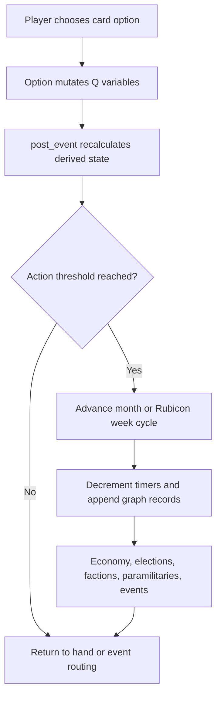

# Dynamic Lewica Mechanics Analysis

This document explains the mechanics of the current `dynamic-lewica` codebase from a game development perspective. It treats the game as an authored political strategy simulation built on top of DendryNexus, with a large shared state object, a card/event presentation layer, and a centralized monthly resolver.

The goal is not to summarize the narrative. The goal is to make the systems legible enough that a designer or programmer can safely rebalance, fork, localize, or extend the game.

## Executive Mental Model

The game is best understood as a deterministic state-machine strategy game disguised as a narrative card game.

Every player choice mutates a global state object, `Q`. Most player-facing choices are Dendry scenes in `source/scenes/**/*.scene.dry`. The game then routes through `source/scenes/post_event.scene.dry`, which acts as the main simulation tick. That file normalizes faction dissent, recalculates elections and force balance, advances time, decrements cooldown timers, updates the economy, records graph data, checks event triggers, and sends the player back to either an event or the next hand of cards.

The dominant design pattern is:

From a game design angle, this creates a high-pressure optimization game. The player is not merely choosing policies. They are managing competing clocks:

- Action economy: usually one card advances a month, while Rubicon mode needs four actions per month.
- Party resources: scarce campaign/organization currency, replenished yearly through dues.
- Government budget: separate fiscal capacity used for state policy.
- Cooldowns: timers prevent spamming high-impact cards.
- Election clocks: national and Prussian elections convert hidden demographic support into seats and coalition options.
- Crisis clocks: historical and alternate-history events fire when time and state conditions align.
- Legitimacy and force clocks: unemployment, inflation, paramilitary force, police loyalty, coup progress, and pro-republic support can outpace the player.

This is why the game works as a strategy design: no single meter is the "health bar." Survival comes from keeping several partially coupled systems below their failure thresholds while building enough long-term support to change the political terrain.

## Source Map

The important mechanics files are:

- `source/scenes/root.scene.dry`: initial state, difficulty setup, resource baselines, timers, mode flags, party/faction/economy/political variables.
- `source/scenes/main.scene.dry`: the main card hand and a large amount of monthly flavor/event surfacing.
- `source/scenes/post_event.scene.dry`: central resolver and simulation tick.
- `source/scenes/election_simulation.scene.dry`: demographic class weights and starting party affinities.
- `source/scenes/election_algorithm.scene.dry`: normalization and vote-share calculation.
- `source/scenes/events/election_1928.scene.dry`: national election resolution, coalition formation, ministries, leverage, and many post-election branches.
- `source/scenes/events/prussia_election_1928.scene.dry`: Prussian election calculation and Prussian coalition formation.
- `source/scenes/party_affairs/*.scene.dry`: party-side cards: campaigning, ideology, Reichsbanner, Iron Front, crisis program, inter-party relations, organizations, media.
- `source/scenes/government_affairs/*.scene.dry`: state-side cards: economic policy, coalition affairs, toleration, Prussian affairs, cabinet, welfare, police, military, judiciary, etc.
- `source/scenes/advisors/*.scene.dry`: pinned advisor/leader powers and special actions.
- `source/qdisplays/*.qdisplay.dry`: qualitative UI conversion for numeric state.
- `out/html/*`: generated playable web build. Useful for testing, not the best source of truth.

The repo uses DendryNexus. Build instructions in `README.md` are simply `dendrynexus make-html`, with package metadata in `package.json`.

## Core State Architecture

The whole game revolves around the `Q` global. It is used as:

- Persistent campaign state.
- Derived-state cache.
- Event trigger ledger.
- Cooldown/timer table.
- UI display source.
- Achievement tracker.

This is powerful but dangerous. It lets almost any card touch almost any system, which is useful for a political sim, but it also means there are few hard module boundaries. Good future design work should preserve the existing vocabulary of state variables instead of adding parallel concepts for the same thing.

Key state groups:

- Time: `year`, `month`, `week`, `time`, `month_actions`, `rubicon_time`, `rubicon_mini_time`.
- Resources: `resources`, `dues`, `base_dues`, `budget`.
- Electoral support: class-party affinities like `workers_spd`, `new_middle_nsdap`, `catholics_z`.
- Party factions: `left_strength`, `center_strength`, `labor_strength`, `reformist_strength`, optional `neorevisionist_strength`, `social_patriot_strength`, plus each faction's dissent.
- Relations: `kpd_relation`, `z_relation`, `ddp_relation`, `dvp_relation`, `lvp_relation`, plus ideological drift inside other parties.
- Government flags: `spd_in_government`, coalition flags, ministry ownership flags, chancellor/president identities.
- Prussia: Prussian coalition flags, `prussia_leader`, police strength/militancy/loyalty.
- Paramilitary: `rb_strength`, `rb_militancy`, `sa_strength`, `sh_strength`, `rfb_strength`, state and police variables.
- Economy: `unemployed`, `inflation`, `economic_growth`, `works_program`, `economic_plan`, `wtb_*`, `nationalization_*`, `capital_strike_progress`, `coup_progress`.
- Event ledger: flags like `black_thursday_seen`, `bruning_event_seen`, `papen_time`, `schleicher_time`, many `flavour_*` triggers.
- Telemetry: `party_support_records`, `economic_records`.

From a systems design standpoint, `Q` contains both base state and derived state. For example, raw values like `workers_spd` are base state, while normalized party vote shares are derived. The code often recalculates derived state in `post_event` or the election algorithm. When extending the game, avoid mutating derived outputs unless the existing mechanic already expects it.

## The Turn And Time Economy

The monthly loop is the game's pacing spine.

Most meaningful cards increment `month_actions += 1` on arrival. In normal play, `post_event` advances one month when `month_actions >= 1`. In Rubicon mode, it advances the month after `month_actions >= 4`, and a separate weekly cadence advances crisis time.

This produces two different games:

- Normal mode: one strategic action per month. Every choice is an opportunity cost.
- Rubicon mode: multiple short crisis actions inside one month. The player has tactical room, but the state deteriorates faster and crisis timers matter more.

At month advance, `post_event`:

- Increments `time` and `month`.
- Rolls the year and grants `resources += dues`.
- Adds a small resource bonus if party dissent is very low.
- Applies a resource penalty if party dissent is high.
- Decrements timers in `Q.timers`.
- Appends party/economic graph records.
- Runs monthly economic drift and a large set of political triggers.

The yearly dues payout is a strong long-horizon pacing tool. It makes party unity more than a roleplay goal: low dissent compounds into future action capacity, while high dissent starves the player of campaign currency.

Design implication: any new card that grants resources, reduces dissent, or bypasses month advancement is extremely high leverage. It should be cooldown-gated or tied to a serious tradeoff.

## Difficulty And Mode Design

Difficulty is not just numeric damage scaling. It changes starting conditions:

- Easy gives more resources, higher dues, stronger Reichsbanner, better relations, and more budget.
- Hard reduces resources and dues, weakens the Reichsbanner, worsens relations, lowers budget, and increases factional dissent.
- Historical mode disables some player comforts and seems tuned toward tighter historical constraints.
- Dynamic mode starts from a modified baseline for alternate or modded play.

This is good design because it changes the player's strategic possibility space rather than simply making all numbers worse. On hard, every subsystem starts closer to a tipping point. On easy, the player can explore the system without every mistake cascading immediately.

For the fork, preserve this approach. Difficulty presets should change initial state and available buffers, not just multiply outcomes.

## Resource Economy

There are two primary currencies:

- `resources`: party organizational capacity, campaign funds, favors, patronage, and activist energy.
- `budget`: state fiscal capacity when the party can influence government.

They interact but are not interchangeable. This separation is one of the game's strongest strategy decisions.

`resources` pay for party actions:

- Campaigning demographics.
- Reichsbanner investment.
- Coalition appeasement.
- Some relationship or organizational moves.

`budget` pays for government policy:

- Public works.
- Social policy.
- Austerity relief.
- Nationalization or economic planning.

The resulting design distinction:

- Opposition play is about party resources, demographic targeting, ideology, and street organization.
- Government play is about cabinet access, coalition friction, fiscal limits, and policy implementation.

This prevents the common political-sim problem where "winning office" is only a reward. Here it is also a new constraint layer.

## Card, Hand, And Cooldown Mechanics

Cards are scene files with Dendry metadata such as `is-card`, `is-pinned-card`, `frequency`, `tags`, `view-if`, `choose-if`, and `on-arrival`.

The design uses several gating layers:

- `view-if`: whether a card or option appears.
- `choose-if`: whether the visible option is selectable.
- `unavailable-subtitle`: why the option is blocked.
- Timers like `campaigning_timer`, `economic_policy_timer`, `coalition_affairs_timer`.
- Resource/budget checks.
- Political checks such as faction strength, coalition type, ministry control, or relations.

This is very suitable for a complex sim because it lets the game expose unavailable strategic possibilities. The player learns the system by seeing what they are not yet able to do.

Pinned advisor cards are a separate layer. They create a leader loadout on top of the random/weighted agenda. Otto Wels, for example, can clear the agenda, reduce party dissent, fundraise, and call snap elections under specific conditions. These powers often use `advisor_action_timer`, creating a shared cooldown across leader abilities.

Design implication: the hand is not just content delivery. It is a tempo system. Adding too many high-frequency cards will dilute scarcity; adding too many pinned powers can flatten the randomness and let the player over-optimize.

## Electoral Demographic Model

The election model is demographic rather than party-national flat support.

`source/scenes/election_simulation.scene.dry` defines demographic classes:

- `workers`
- `old_middle`
- `new_middle`
- `rural`
- `unemployed`
- `catholics`

Each class has raw affinities for parties:

- Example: `workers_spd`, `workers_kpd`, `workers_nsdap`.
- Example: `new_middle_ddp`, `new_middle_dvp`, `new_middle_nsdap`.

`source/scenes/election_algorithm.scene.dry` then:

1. Clamps negative class-party support to zero.
2. Sums each class's party affinities.
3. Normalizes each class internally.
4. Multiplies each normalized class result by that class weight.
5. Sums party support across classes.
6. Normalizes total national vote share.
7. Rounds to one decimal.

This creates several useful design properties:

- A party can grow by dominating a class even if it is weak elsewhere.
- Campaigning workers is not equivalent to campaigning Catholics or the middle class.
- Economic shifts matter because they move class weights, especially unemployment.
- Actions that change class affinities have delayed electoral payoff.
- Big support numbers in one class do not automatically translate into national dominance if the class is small.

The model also supports alternate-party fragmentation:

- "Other" can be split into CNBLP, WP, ASPD, DNEF-related blocs, and more.
- NSDAP can split into Hitler, DSU, and NVF components under certain routes.
- Prussia uses a related but separate election calculation.

From a game design perspective, this is a hybrid of deterministic simulation and deckbuilding-style targeting. The player is effectively building a coalition of voter segments, not just raising a single popularity meter.

## Party Factions And Dissent

The SPD internal faction system is the game's internal stability model.

Core factions:

- Left.
- Center.
- Labor.
- Reformist.
- Optional neorevisionist.
- Optional social patriot.

Each faction has two major values:

- Strength: how much of the party that faction represents.
- Dissent: how alienated that faction is.

`post_event` normalizes faction strengths and computes overall `dissent` as a weighted average. It then clamps dissent between 0 and 0.95. Many effects use `(1 - dissent)` as a multiplier, especially campaign gains. This turns party disunity into a global efficiency tax.

This is elegant because dissent is not merely a failure meter. It lowers the yield of otherwise good actions. A divided party can still campaign, govern, and organize, but it gets less out of each action.

Factions are also content gates:

- The Labor faction is tied to WTB/public works.
- The Left is tied to nationalization, KPD relations, and class struggle.
- Reformists are tied to democratic coalitions and moderate job creation.
- Centrists are tied to party discipline and orthodox caution.
- Social patriots open special nationalist/Schleicher-adjacent paths.

Design implication: faction mechanics create "builds" inside the party. A player is not just maximizing SPD support; they are deciding what kind of SPD can exist.

## Ideology As Build Commitment

`source/scenes/party_affairs/ideology.scene.dry` lets the player set an ideological course. Each option shifts faction strength, dissent, inter-party relations, and future program support.

Examples:

- Class struggle increases left strength, improves KPD relation, and supports nationalization.
- Labor improves WTB momentum but worsens KPD relation.
- Reform improves democratic coalition relations and moderate-plan support.
- Centrist reduces broad dissent and stabilizes the internal party.
- Social patriot, if unlocked, improves center-right relations but worsens left/center discomfort.

The card has a long cooldown and penalizes changing course. That makes ideology a semi-commitment rather than a free stance toggle.

From a game design view, ideology is the "spec tree" selector. It shapes which later cards are affordable, legitimate, or politically survivable.

## Campaigning Mechanics

Campaigning is a direct bridge from player action to election model.

`source/scenes/party_affairs/campaigning.scene.dry` lets the player spend `resources` to increase SPD affinity in a target demographic. Most gains are multiplied by `(1 - dissent)`. Some targets have contextual modifiers:

- Workers and unemployed are harder to persuade when unemployment is extreme.
- WTB adoption improves worker and unemployed campaigning.
- Middle-class and rural campaigning is weaker if the party has not built a People's Party identity.
- Welfare cuts hurt unemployed campaigning.
- Rural policy improves rural campaigning.
- Catholic campaigning is gated behind People's Party development.

The card is simple but important: it gives the player agency over the demographic model. It also shows how the game avoids a single optimal campaign target. Different voter groups require prior strategic investment.

Design implication: demographic campaigning is a conversion mechanic. It converts scarce resources and party unity into class-specific future vote share.

## Inter-Party Relations

Relations are not flavor. They are mechanical access keys.

Important relationship axes:

- KPD relation: affects left-front/popular-front paths, RFB truces, toleration of cooperation, and communist demands.
- Center/CVP relation: affects Weimar/social-Catholic coalitions, toleration, Prussian retaliation, and government stability.
- DDP/DStP/LVP/DVP relations: affect bourgeois coalition stability, ministry concessions, economic obstruction, and party realignments.

Relationship work often costs resources and increases dissent among factions that dislike compromise. This creates a classic diplomacy tradeoff:

- Improve external coalition capacity.
- Pay internal ideological cost.
- Delay direct campaigning or paramilitary investment.

The game also tracks ideological drift and cohesion inside non-player parties. This lets the political map react to the player's behavior: liberals can merge or radicalize; conservatives can split; Center can mutate into CVP/KVP variants; DNVP/DVP relationships can create new blocs.

From a design perspective, external parties are not static NPCs. They are semi-simulated actors whose future shape depends on repeated pressure.

## Government And Coalition Mechanics

Winning office changes the game from party-building to constrained implementation.

Government state is represented by:

- `spd_in_government`.
- Coalition flags such as `in_weimar_coalition`, `in_grand_coalition`, `in_popular_front`, `in_left_front`, `in_spd_majority`, `in_minority_government`.
- Chancellor/president identity.
- Ministry ownership variables like `finance_minister_party`, `economic_minister_party`, `interior_minister_party`, etc.
- `coalition_dissent`.
- `leverage`.

The key design move is ministry ownership. Many government cards require the SPD to hold the relevant ministry. Economic policy requires Finance or Economic control. Policing, justice, military, and welfare cards similarly depend on office access.

This means elections do not simply unlock all policy. Seat share, coalition partner strength, leverage, and ministry allocation decide what the player can actually do.

`source/scenes/government_affairs/coalition_affairs.scene.dry` shows the coalition pressure loop clearly. If `coalition_dissent` rises, the player can:

- Concede Prussian access to the DVP.
- Promise welfare cuts.
- Spend party resources to pacify allies.
- Bring down their own government.
- Refuse and risk collapse elsewhere.

This is strong gamedev design because coalition pressure transforms "good policy" into a multidimensional choice. Public works, nationalization, and welfare protection can improve support but destabilize government partners.

## Toleration Mechanics

External toleration is a distinct political stance, not simply opposition.

In toleration, the SPD supports a government without holding full power. `source/scenes/government_affairs/dealing_with_toleration.scene.dry` lets the player:

- Break toleration and trigger elections.
- Pressure the government against austerity.
- Seek anti-paramilitary decrees.
- Improve relations.
- Stay the course.

The cost is clear: toleration protects short-term stability but associates the SPD with unpopular austerity and limits policy control. Breaking it may satisfy the left but can destabilize Prussia and empower extremists.

From a design perspective, toleration is a "lesser evil" mechanic. It asks whether preventing immediate collapse is worth long-term brand damage.

## Cabinet And Ministry Control

Cabinet mechanics turn electoral leverage into concrete verbs.

After elections, `source/scenes/events/election_1928.scene.dry` handles government formation and ministry allocation. The player can gain or lose `leverage` depending on seat share, coalition partners, Prussian concessions, and leader choices. Cabinet shuffle can reopen ministry allocation but increases coalition dissent.

This creates a second-order election reward:

- Vote share gives seats.
- Seats give coalition options.
- Coalition options give leverage.
- Leverage buys ministries.
- Ministries unlock policy cards.
- Policy cards alter economic, factional, electoral, and crisis variables.

This chain is one of the most important things to preserve in a fork. It makes elections meaningful without reducing them to a binary win/loss.

## Prussia As A Subgame

Prussia is not just another regional event chain. It is a parallel power base.

Prussian state includes:

- Separate election timing.
- Separate coalition flags.
- `prussia_leader`.
- Police strength, militancy, and loyalty.
- Prussian government alignment.

`source/scenes/government_affairs/prussian_affairs.scene.dry` gives the player tools that affect national survival:

- Increase police loyalty.
- Expand police strength.
- Purge anti-democratic officials.
- Ban or prosecute SA, RFB, and Stahlhelm.
- Negotiate church/political settlements.

The key mechanical insight is that Prussia converts local control into national street power. Loyal Prussian police count toward the democratic force bloc. If hostile leaders like Papen, Schleicher, or Strasser control Prussia, police force can flip into state force instead.

This is a good example of spatial abstraction. The game does not simulate every German state, but it gives Prussia enough mechanics to feel like a strategic fortress. Losing it meaningfully changes the force balance.

## Paramilitary And Street Control

The paramilitary model is one of the game's strongest systemic loops.

Forces include:

- Reichsbanner: democratic/SPD-aligned mass defense.
- SA: Nazi force.
- Stahlhelm: nationalist/right force.
- RFB: communist force.
- Prussian police.
- Reichswehr/state force under some conditions.

`post_event` calculates effective force as strength times militancy, with loyalty modifiers for police and army. It then normalizes the force distribution and builds blocs:

- `far_right_force = SA + Stahlhelm`.
- `democracy_force = Reichsbanner + loyal Prussian police`.
- `state_force = Reichswehr and hostile police under some regimes`.
- RFB can join democratic force if a KPD truce exists.

Dominance bands are then set:

- Low.
- Medium.
- High.
- Highest.

Those bands feed monthly political drift. Far-right street dominance strengthens NSDAP and weakens republican parties. Democratic street dominance boosts SPD/pro-republic outcomes and can blunt Nazi growth. State dominance matters especially in Rubicon and authoritarian routes.

The design is clever because street control is not a battle minigame. It is a background pressure system that continuously changes electoral and legitimacy terrain.

Player tools include:

- Reichsbanner investment.
- Iron Front mobilization.
- Streetfighting escalation.
- KPD/RFB truce.
- Prussian policing.
- Bans and prosecutions against paramilitaries.

Every tool has costs:

- Militarizing Reichsbanner can worsen bourgeois relations.
- Streetfighting can provoke SA growth.
- KPD cooperation can anger moderates.
- Police repression can hurt KPD relation or reduce civil liberties.
- Underinvestment lets the far right dominate public space.

This is a well-formed risk-reward loop: both passivity and escalation are dangerous.

## Economic Simulation

The economy is a coupled background simulation rather than a pure event script.

Core variables:

- `unemployed`.
- `inflation`.
- `economic_growth`.
- `budget`.
- `works_program`.
- `capital_strike_progress`.
- `coup_progress`.

`post_event` implements monthly economic drift:

- Deficits raise inflation, with different bands.
- Deflation raises unemployment.
- Negative growth raises unemployment.
- Strong growth lowers unemployment.
- Very high growth decays back downward.
- Inflation/deflation and unemployment affect pro-republic conditions and crisis paths.

Historical event files add large macro shocks, especially after Black Thursday and through 1930-1932. But the player's policies can materially change the trajectory.

This gives the economy two layers:

- Authored history: Great Depression pressure, banking crisis, emergency decrees.
- Systemic response: unemployment, inflation, budget, and support move month by month.

From a game design perspective, this makes economic policy a control-system problem. The player is trying to steer a lagging system with blunt interventions under political constraints.

## Economic Programs

The party must first adopt an economic line before fully implementing policy.

`source/scenes/party_affairs/crisis_program.scene.dry` handles internal program adoption:

- Centrist: do little or let the depression play out.
- Labor: WTB/public works and fiscal stimulus.
- Left: nationalization and socialist transformation.
- Reformist: moderate job creation without deficit spending.

`source/scenes/government_affairs/economic_policy.scene.dry` handles implementation once the SPD has government access and ministry control.

Major design arcs:

- WTB/public works: strong worker/unemployed gains, lower unemployment, higher inflation, coalition friction if deficit-funded.
- Moderate plan: safer coalition politics, smaller gains, lower radicalism.
- Nationalization: strong left and worker gains, unemployment reduction, major capital strike and coup risk.
- Austerity: budget relief but harms support, raises radicalization, and weakens democratic legitimacy.

This is not a simple policy tree. Adoption depends on internal faction strength; implementation depends on government position; consequences feed back into elections, coalition stability, class support, and crisis risks.

Design implication: economic policy is the main bridge between ideology, state capacity, electoral support, and regime survival.

## Event System

The game mixes scheduled historical events with reactive alternate-history events.

Events are mostly individual scene files under `source/scenes/events/`. They are surfaced through conditions in `main.scene.dry` and `post_event.scene.dry`.

Event triggers often depend on:

- Date.
- Week in Rubicon mode.
- Current chancellor/president.
- Coalition composition.
- Party vote shares.
- Relations.
- Economic conditions.
- Prior event flags.
- Crisis values such as `hindenburg_angry`, `capital_strike_progress`, `coup_progress`, `nazi_peak`, `pro_republic`, and paramilitary dominance.

This gives the game its alternate-history feel. The timeline is not freeform sandbox chaos, but it is not a railroad either. Historical beats act as pressure, while state variables decide which version of a beat fires.

The main design value is conditional specificity. Events feel authored because they reference exact political situations, but they are still mechanically earned.

## Rubicon Mode

Rubicon mode appears to represent late-crisis constitutional breakdown, especially Papen/Schleicher/authoritarian routes.

Mechanically, Rubicon changes time granularity:

- One month requires four actions.
- Weekly time and Rubicon-specific timers matter.
- Crisis event routing differs from normal monthly play.
- State force and emergency politics become more central.

This is a mode shift, not a mere difficulty spike. It changes the player's cadence from slow strategy to rapid crisis management. From a game design standpoint, that is valuable because it makes the endgame feel different without changing the underlying engine.

When extending Rubicon content, preserve the four-actions-per-month structure. It is the source of the mode's tactical feel.

## Achievements And Meta Goals

Achievements are stored in state and triggered by route outcomes or unusual strategic accomplishments. They serve three purposes:

- Reward discovery of rare branches.
- Signal that the simulation recognizes an unusual political outcome.
- Unlock challenge or novelty options in some cases.

This is especially useful in an alternate-history game because players need a reason to explore non-obvious paths. Achievements turn the large possibility space into a set of discoverable design goals.

For a fork, achievements can also work as a regression checklist. If a change breaks major achievements, it probably broke a route.

## UI And Feedback

The UI abstracts many raw numbers through qdisplays:

- Dissent.
- Relationships.
- Coalition dissent.
- Strength.
- Militancy.
- Loyalty.
- Hindenburg anger.
- Nazi funds.
- Other route-specific meters.

This is an important design choice. The underlying sim is numeric, but the player mostly sees qualitative bands. That supports uncertainty and roleplay while still letting experienced players learn the thresholds.

The game also records:

- `party_support_records`.
- `economic_records`.

These feed graphs and retrospective feedback. The parliament visualization uses generated support/seat data to make elections tangible.

Design implication: do not expose every number just because it exists. The current design uses opacity as a balance tool.

## Major Feedback Loops

### Party Unity Loop

1. Player chooses ideological or coalition action.
2. Faction dissent changes.
3. Overall `dissent` changes.
4. Campaigning and relationship gains are multiplied by `(1 - dissent)`.
5. Lower efficiency weakens electoral gains.
6. Weak results increase pressure to take more divisive actions.

This is a soft failure spiral. It does not instantly kill the player, but it reduces future agency.

### Economic Crisis Loop

1. Depression increases unemployment and radical support.
2. Player adopts and implements economic policy.
3. Policy reduces unemployment or increases budget.
4. Policy may increase inflation, coalition dissent, capital strike, or coup progress.
5. Economic outcomes feed class support and republican legitimacy.
6. Elections and events decide whether the player keeps policy access.

This is the core political economy loop.

### Street Control Loop

1. Far-right, democratic, communist, and state forces grow or shrink.
2. `post_event` calculates force dominance.
3. Dominance shifts party support and `pro_republic`.
4. Support changes affect future events and force growth.
5. Player chooses whether to escalate, ban, cooperate, or demobilize.

This gives the late Weimar setting systemic pressure without needing a tactical combat layer.

### Coalition Loop

1. Elections produce possible coalitions.
2. Coalition choice determines ministries and leverage.
3. Policies anger or appease coalition partners.
4. `coalition_dissent` triggers crisis cards.
5. Concessions preserve government but anger factions or reduce policy freedom.
6. Collapse triggers elections or new authoritarian paths.

This loop makes parliamentary politics mechanically meaningful.

### Prussia Loop

1. Prussian elections and coalitions decide who controls the state.
2. Prussian police can support democracy or state/authoritarian power.
3. Police and bans affect paramilitary balance.
4. Prussian concessions can stabilize Reich coalitions.
5. Losing Prussia weakens democratic force and can trigger retaliation or coups.

This makes a single regional subsystem carry national strategic weight.

## Why The Mechanics Are Strong

The game has several design strengths worth preserving:

- Multiple currencies prevent a single dominant strategy.
- Demographic elections make political support feel material and class-based.
- Dissent as an efficiency tax is more interesting than dissent as a binary fail state.
- Ministry control makes government formation more than a cutscene.
- Paramilitary force turns public order into a continuous political variable.
- Prussia gives the player a strategic fortress that can be bargained away.
- Historical events are conditional enough to feel reactive.
- Cooldowns and action economy create hard tempo pressure.
- Qualitative displays prevent the sim from becoming a spreadsheet while still preserving depth.

The best part of the design is that almost every action has at least three consequences:

- Immediate state change.
- Faction or relationship cost.
- Delayed event/election implication.

That is the signature pattern to preserve in the fork.

## Mechanical Risks And Implementation Hazards

These are not necessarily bugs, but they are areas to treat carefully.

### Shared Global State

Because nearly everything writes to `Q`, naming collisions and stale flags are easy. Before adding a new variable, search the whole source tree for similar concepts. Prefer extending existing variables over creating a duplicate.

### Derived State Mutation

Vote shares, force shares, normalized faction strength, and graph records are derived. New cards should generally modify raw inputs, not normalized outputs.

### Timer Consistency

Most cards use `month_actions += 1` and a `*_timer`. A few files should be checked before deeper work. For example, `source/scenes/advisors/shuffle_leadership_pinned.scene.dry` uses `month_activities += 1`, while the rest of the loop watches `month_actions`. If this is not intentional, it can make that pinned card bypass the normal monthly tempo.

### Boolean Precedence

Dendry conditions often combine `and` and `or` in long `view-if` or `choose-if` expressions. Parenthesize aggressively when editing. A misplaced condition can expose major route content at the wrong time.

### Repeated Coalition Code

Election and coalition formation files contain many repeated flag resets. This is understandable in Dendry scene code, but it raises desync risk. When adding a new coalition type, update both national and Prussian reset lists consistently.

### Generated Output

Do not hand-edit `out/html` as the source of mechanics. The source is under `source/`. Regenerate the build instead.

## Extension Guidance For Dynamic Lewica

If this fork is going to become a Polish-left or Lewica adaptation rather than a straight copy, the safest approach is to preserve the engine-level mechanics and replace content in layers.

Recommended order:

1. Document the target political period and actors.
2. Map each actor to an existing mechanical role before inventing new systems.
3. Reuse the demographic election model, but rename classes only if the new setting needs it.
4. Keep separate party resources and government budget.
5. Keep internal faction strength/dissent as the party identity engine.
6. Keep a regional or institutional subgame equivalent to Prussia if the setting has one.
7. Keep a street/institutional power model if democratic breakdown or mobilization remains central.
8. Replace event content gradually, while preserving the `post_event` resolver pattern.
9. Add constants or comments around new balance values.
10. Test by simulating several years with extreme strategies: pure left, pure reformist, pure coalition, pure street defense, pure campaigning.

## Suggested Mechanical Translation Pattern

For adapting content, think in mechanical roles:

| Existing Mechanic | Role In The Game | Adaptation Question |
| --- | --- | --- |
| SPD factions | Internal ideology and efficiency | What factions inside Lewica or the player party matter mechanically? |
| Center/DVP/DDP/KPD relations | Coalition and alliance access | Which external parties gate government or protest alliances? |
| Prussia | Strategic institutional fortress | What institution/region can protect or endanger democracy? |
| Reichsbanner/Iron Front | Organized street defense | What is the equivalent of mobilized civil society or party defense? |
| WTB/public works | Anti-crisis economic program | What is the flagship economic intervention? |
| Nationalization | Transformational left route | What radical program creates support and elite backlash? |
| Toleration | Lesser-evil support | What political situation forces support without control? |
| Hindenburg/camarilla | Elite veto point | What institution or office can override parliamentary politics? |
| Black Thursday | Exogenous shock | What crisis forces the whole system to respond? |

This avoids shallow reskinning. The question is not "what is the Polish name for this card?" The question is "what pressure, gate, cost, or feedback loop did this mechanic represent, and what is the correct equivalent?"

## Balancing Heuristics

Use these when changing numbers:

- A direct class support gain of 5-8 is significant, especially if repeatable.
- Anything multiplied by `(1 - dissent)` becomes self-balancing through party unity.
- Resource costs are severe because resources replenish yearly, not monthly.
- Budget costs are severe only if the player is in or near government and policy access matters.
- `coalition_dissent += 1` is a major cost if the player depends on bourgeois partners.
- `capital_strike_progress` and `coup_progress` are delayed-threat costs and should buy large immediate gains.
- Paramilitary strength without militancy may be symbolic; militancy changes effective force quickly.
- Police loyalty is more valuable than raw police strength if Prussia might flip.
- Cooldown length is as important as numeric effect. A strong 12-month card can be safer than a weak spammable card.
- Route unlocks should usually require at least two of: ideology, faction strength, relation, ministry control, event flag, resource/budget.

## Testing Strategy

There is no obvious automated mechanics test suite in the current repo. For serious fork work, add a lightweight simulation harness or at least manual scenario checklists.

Minimum manual tests after changes:

- Start each difficulty and verify the first hand appears.
- Campaign each demographic and confirm vote shares move after an election.
- Trigger Black Thursday and verify crisis program options appear.
- Adopt WTB, moderate, and nationalization routes in separate saves.
- Enter government and verify ministry-gated cards appear only when appropriate.
- Raise coalition dissent and verify coalition affairs appears.
- Trigger Prussian election and verify Prussian coalition state resets cleanly.
- Build Reichsbanner dominance and verify street-control effects.
- Allow far-right dominance and verify NSDAP/pro-republic drift.
- Enter Rubicon and verify four actions advance a month.

For programmer-facing tests, the highest value would be a deterministic `Q` state snapshot runner:

1. Load a fixture state.
2. Apply one card option mutation.
3. Run the `post_event` resolver.
4. Assert selected variables.

Even a small fixture set would catch most regressions caused by route edits.

## Design North Star

The game's strongest identity is not "choose the correct historical answer." It is "hold together a party, a coalition, an economy, and a republic while each solution damages another part of the system."

That should be the north star for `dynamic-lewica`.

Good new mechanics should usually satisfy this test:

- Does the action solve a real pressure?
- Does it anger or empower a specific faction?
- Does it shift a demographic or institutional base?
- Does it create a delayed risk or future gate?
- Does it interact with at least one existing loop?

If the answer is yes, it belongs in this design language. If an action only adds support or only displays narrative, it will feel weaker than the rest of the system.

